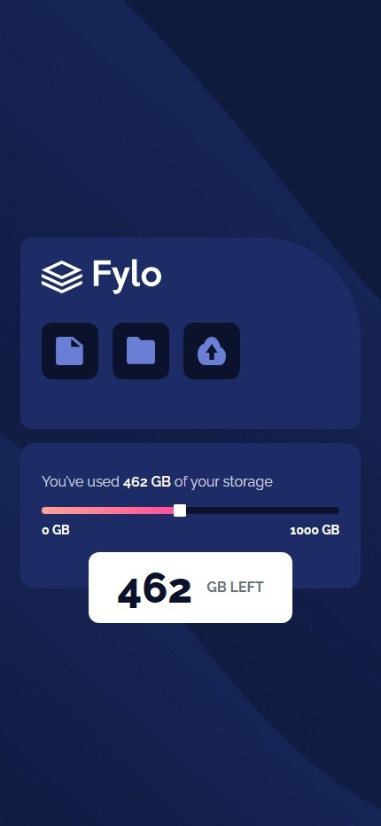

# Frontend Mentor - Fylo data storage component solution

This is a solution to the [Fylo data storage component challenge on Frontend Mentor](https://www.frontendmentor.io/challenges/fylo-data-storage-component-1dZPRbV5n). Frontend Mentor challenges help you improve your coding skills by building realistic projects.

## Table of contents

- [Overview](#overview)
  - [The challenge](#the-challenge)
  - [Screenshot](#screenshot)
  - [Links](#links)
- [My process](#my-process)
  - [Built with](#built-with)
  - [challenges](#challenges)

## Overview

### The challenge

Users should be able to:

- View the optimal layout for the site depending on their device's screen size

### Screenshot

- Desktop View

- Mobile View

### Links

- Solution URL: [https://rookie-project-07.netlify.app/](https://rookie-project-07.netlify.app/)
- Live Site URL: [https://github.com/akshay-ken/rookie-project-07](https://github.com/akshay-ken/rookie-project-07)

## My process

### Built with

- Semantic HTML5 markup
- CSS custom properties for webkit
- Flexbox
- Tailwind
- Mobile-first workflow
- [React](https://reactjs.org/) - JS library

### Challenges

> Problem: i was unable to use both rounded-2xl and rounded-tr-full tailwind class

- **solution**:- i checked computed values in my dev tool for that element and it showed both values are applied the issue is 2xl value is really small and full value is really big in e so i used custom rem value for it and it solved my issue;

> problem: i wondered to use label or span tag for range type input

- **solution**:- but then decide for accessibility i will use labels along with my range input and put them in flex-box.

> problem: created box with absolute and relative positioning but now wanted to add tail on desktop view using tailwindcss.

- **solution** : i was able to shift position of box on desktop and mobile view but having trouble creating its tail so i asked ai to just write simple triangle using div tag and it gave me bare minimum structure which i modified latter and made it look like speech buble as whole.

> problem : i tried to make slider look exactly as the same and add interactivity to it even when challange just says to make it look right but not working.

- **solution** : and now i realize why it didn't ask to make it interactive because it cant if you use input range element for it so while trying to separate both colored and uncolored portion of slider i realized i cant change it simply without adding more complexity or guidance from senior dev as i tried to debug it for 4hrs with ai its waste of time to separate those two gradient and make other end of gradient rounded is so hard but i was able to make other progress bar behind it and made it look 90% as design only thing was left that right round on gradient edge which is hard so i decided to keep it simple and changed the design of slider.
